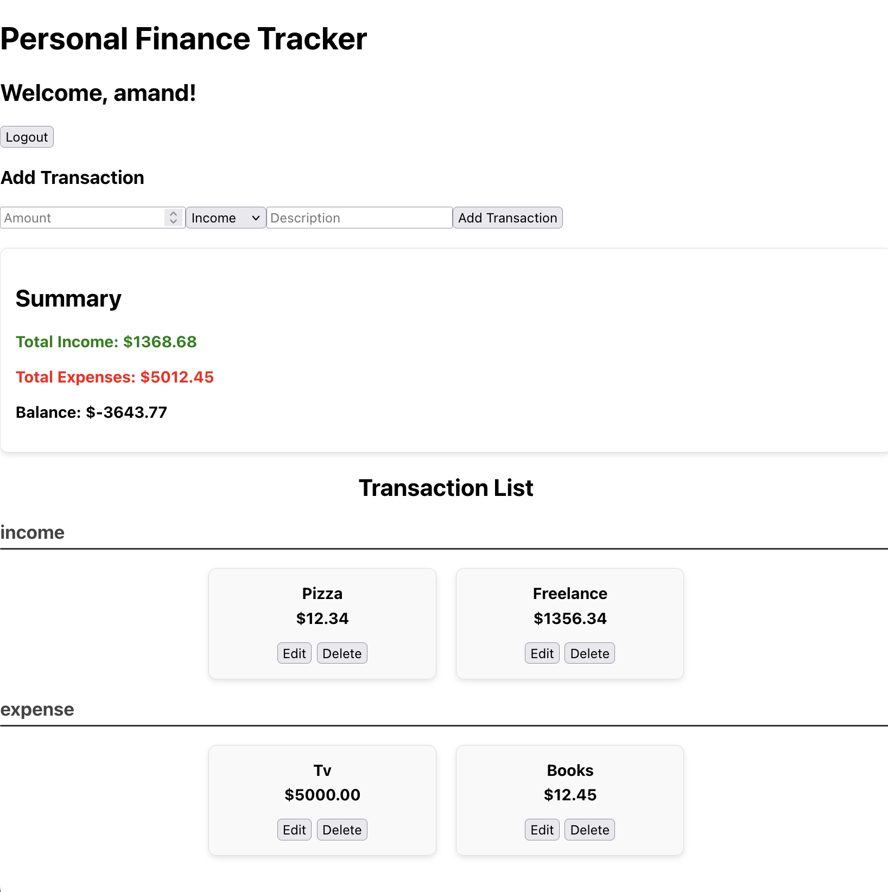

# Personal Finance Tracker

## Project Overview
The Personal Finance Tracker is a web application that allows users to track their income and expenses. Users can add, edit, and delete transactions, view their transaction history, and see a summary of their financial status. **Please note that this project primarily focused on backend development; therefore, the frontend may not be visually appealing.**


  <!-- Change the path as needed -->

## Features
- User registration and login
- Add, edit, and delete transactions
- View transactions grouped by category
- View financial summary including total income, expenses, and balance

## Technologies Used
- **Frontend:** React.js, Tailwind CSS
- **Backend:** Flask, MongoDB
- **Package Management:** npm for frontend, pip for backend

## Getting Started

### Prerequisites
- Node.js (for frontend)
- Python 3.x (for backend)
- MongoDB (for database)

### Installation

1. **Clone the repository:**
   ```bash
   git clone <YOUR_REPOSITORY_URL>
   cd <YOUR_PROJECT_FOLDER>
